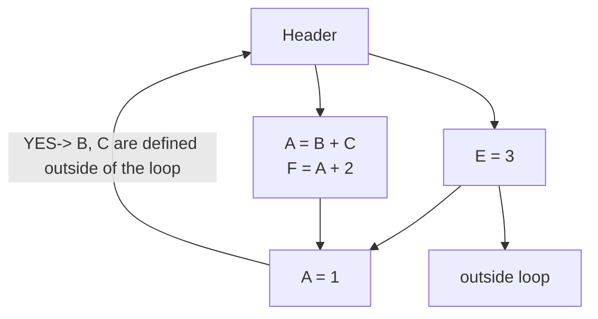

# Compilers Backend Assignments

Various optimizations passes leveraging the LLVM IR.

This repository contains a standalone version of the optimization passes, tested for LLVM 17.0.6. A full version of LLVM's source code, with our passes plugged-in, can be found [here](https://github.com/mc-cat-tty/llvm-17.0.6-compilers).

## First assignment

Implementare tre passi LLVM (dentro lo stesso passo LocalOpts già scritto durante il LAB 2) che realizzano le seguenti ottimizzazioni locali:
 
 1. Algebraic Identity
    - $x + 0 = 0 + x \Rightarrow x$
    - $x \times 1 = 1 \times x \Rightarrow x$

 2. Strength Reduction (più avanzato)
    - $15 \times x = x \times 15 \Rightarrow (x << 4) – x$
    - $y = x / 8 ⇒ y = x >> 3$

 3. Multi-Instruction Optimization	
    - $a = b + 1, c = a − 1 ⇒ a = b + 1, c = b$

## Testing Logic

### Directories
The `testing` directory tree looks like this:

```bash
testing
├── expected
│   ├── advanced_pow2_sr_expected.ll
│   ├── algebraic_id_expected.ll
│   ├── basic_pow2_sr_expected.ll
│   ├── edge_cases_expected.ll
│   └── multi_instr_expected.ll
├── optimized
│   ├── advanced_pow2_sr_optimized.ll
│   ├── algebraic_id_optimized.ll
│   ├── basic_pow2_sr_optimized.ll
│   ├── edge_cases_optimized.ll
│   └── multi_instr_optimized.ll
└── tests
    ├── advanced_pow2_sr.ll
    ├── algebraic_id.ll
    ├── basic_pow2_sr.ll
    ├── edge_cases.ll
    └── multi_instr.ll
```

Where:
- tests -> contains some samples of IR code to check if our opt passes work
- expected -> contains the `expected outcome`, our desired results that our opt passes should reach
- optimized -> contains the IR code generated with our opt passes
  
### Automated testing
the bash script `testing.sh` automatically generates all the `optimized.ll` and put them in `optimized` files for every test in `tests`.

It also checks if every `expected.ll` and `optimized.ll` are equal, and if it's true, the test is passed.

## Coding Style
### Naming Conventions
 - Type definitions (classes, structs, and so on) -> `PascalCase`
 - Methods -> `camelCase`
 - Variables -> `camelCase`

### Indentation
Tabs must be expanded as **2 spaces**.

## Second Assignment
### Dataflow Analysis Assignment

**For each of the following three analysis problems:**

1. Derive a formalization for the Dataflow Analysis framework, filling in the table with the appropriate  
   parameters:
   - Domain
   - Direction
   - Transfer Function
   - Meet Operator
   - Boundary Condition
   - Initial interior points
     
2. For the provided example CFG, populate a table with the iterations of the iterative algorithm solving the problem:
   
|      | Iterazione 1 |          | Iterazione 2 |          | Iterazione 3 |          |
|------|--------------|----------|--------------|----------|--------------|----------|
|      | IN[B]        | OUT[B]   | IN[B]        | OUT[B]   | IN[B]        | OUT[B]   |
| BB1  | <...>        | <...>    |              |          |              |          |
| BB2  |              |          |              |          |              |          |
| BB3  |              |          |              |          |              |          |

### 1. Very Busy Expressions

### 2. Dominator Analysis

### 3. Constant Propagation

## Third Assignment
### Loop Invariant Code Motion

Starting from the code of the previous exercise, **implement** a step of `**Loop-Invariant Code Motion (LICM)**`.
- Do **not** use the acronym _LICM_ for the step.
- It would **conflict** with the _official_ LLVM step.

- **Move** the instructions that are **not dependent** on the loop's **control flow out of the loop** itself.
- **Avoid redundantly** recalculating the same thing.
- Since the bulk of a program's computation is contained within loops, there is _enormous_ **potential** for performance improvement.

Which instructions are **loop-invariant** in this example?


- **code motion:** with this practice we move loop invariant instructions inside the **preheader** block

### LICM algorithm

Observations:
 - Loop-invariant instructions
    -  Operands are defined outside the loop or through instructions that are loop-invariant
 - Code motion
    - Not all loop-invariant instructions can be moved into the preheader
   
Algorithm (three macro phases):
 - We find the loop-invariant instructions
 - We verify that the conditions for code motion are met
 - We move the instructions

**Conditions for Code Motion:**
- General conditions (applicable to all transformations):
- Correctness: Code movement does not alter the semantics of the program
- Performance: The execution of the code is not slowed down

### Code Motion algorithm

**Given a set of nodes in a loop:**
- Calculate the reaching definitions
- Find the loop-invariant instructions
- Compute the dominators (dominance tree)
- Find the loop exits (successors outside the loop)
- Instructions eligible for code motion:
   - They are loop invariant
   - They are located in blocks that dominate all loop exits
   - They assign a value to variables not assigned elsewhere in the loop
   - They are located in blocks that dominate all blocks in the loop using the variable to which a value is being assigned
- Perform a depth-first search of the blocks
   - Move the candidate instruction to the preheader if all invariant instructions on which it depends have been moved


## Contributors
 - Christofer Fanò [@ch-fano]
 - Francesco Mecatti [@mc-cat-tty]
 - Antonio Stano [@ent0n29]

## License
MIT
