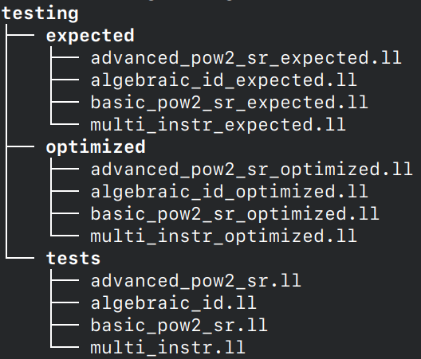

# Compilers Backend Assignments

Various optimizations passes leveraging the LLVM IR.

This repository contains a standalone version of the optimization passes, tested for LLVM 17.0.6. A full version of LLVM's source code, with our passes plugged-in, can be found [here](https://github.com/mc-cat-tty/llvm-17.0.6-compilers).

## Primo assignment

Implementare tre passi LLVM (dentro lo stesso passo LocalOpts già scritto durante il LAB 2) che realizzano le seguenti ottimizzazioni locali:
 
 1. Algebraic Identity
    - $x + 0 = 0 + x \Rightarrow x$
    - $x \times 1 = 1 \times x \Rightarrow x$

 2. Strength Reduction (più avanzato)
    - $15 \times x = x \times 15 \Rightarrow (x << 4) – x$
    - $y = x / 8 ⇒ y = x >> 3$

 3. Multi-Instruction Optimization	
    - $a = b + 1, c = a − 1 ⇒ a = b + 1, c = b$

## Testing Logic

### Directories
The _testing_ directory tree looks like this:

Where:
- tests -> contains some samples of IR code to check if our opt passes work
- expected -> contains the _expected outcome_, our desired results that our opt passes should reach
- optimized -> contains the IR code generated with our opt passes
  
### Automated testing
the bash script _testing.sh_ automatically generates all the _optimized.ll_ and put them in _optimized_ files for every test in _tests_.

It also checks if every _expected.ll_ and _optimized.ll_ are equal, and if it's true, the test is passed.

## Coding Style
### Naming Conventions
 - Type definitions (classes, structs, and so on) -> `PascalCase`
 - Methods -> `camelCase`
 - Variables -> `camelCase` or `PascalCase`

### Indentation
In our sources, **4 spaces indentation** has been adopted "de facto"; however, the rest of LLVM project, uses **2 spaces indentation**.

## Contributors
 - Christofer Fanò [@ch-fano]
 - Francesco Mecatti [@mc-cat-tty]
 - Antonio Stano [@ent0n29]
